# Exercise 2: 10 Linux Commands
This folder contains my exercise for the 10 linux commands i learnrt  other thanthe commands mentioned  on the LMS video for week 3 

## 1. `whoami` command
The `whoami` command (short for “who am i”) displays the username currently in use
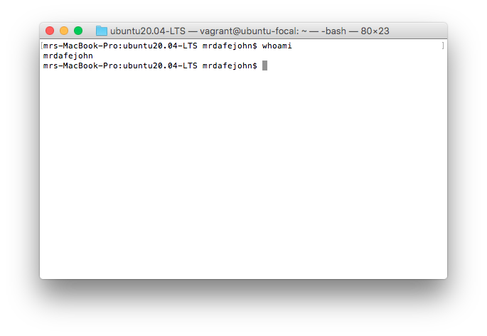

## 2. `grep` command
The `grep` command searches for lines in a file that match a string or regular expression and prints them.
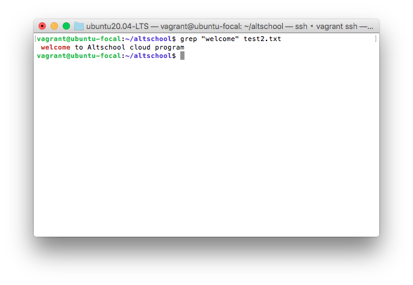

Here `welcome` is the word we are searching for in the file test2.txt
You can count the number of times the string is repeated by adding `-c` flag
e.g `grep -c "welcome" test2.txt`
it will return `1` because welcome only appears one time in the file content.
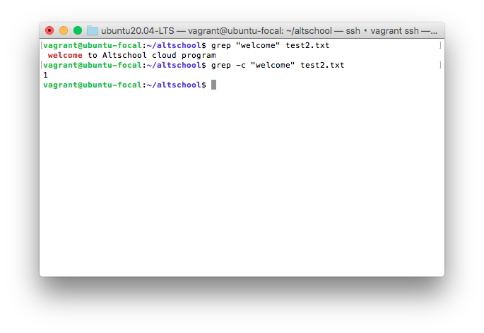

## 3. `history` command
This command is used to display enumerated list of commands you have used in the past. If you are struggling to remember comands you have used on your terminal, `history` comes in here as it will give a list.
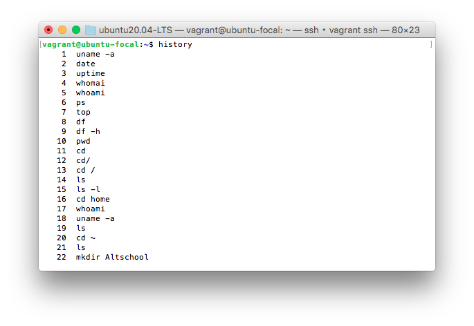

## 4. `ps` command 
The `ps` command displays processes your current shell session is running. It prints useful information about the program running, information like, program ID, TTY(TeleTYpewriter), time and the command name

## 5. `echo` command
The `echo` command displays defined text in the terminal. for example, if you wan the text hey and the name of the current user to display on the terminal, you type `hey $USER` and this will display "hey vagrant" because my currrent user is vagrant.
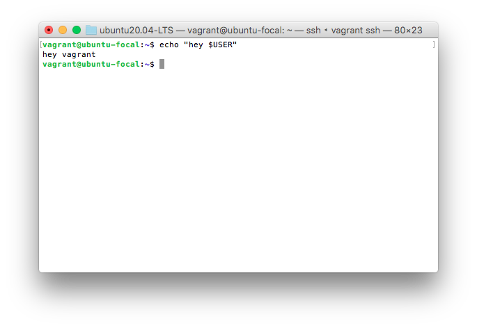

You can also use it to display simple messages like `echo "Welcome to Linux"`

The echo command can also be used to write directly into a new file
`echo "i am learning linux" > linux.md`
This will create the file linux.md with the specified content in it. You can use the command `cat linux.md` to display the message on terminal

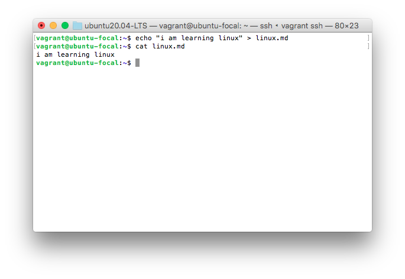 

## 6. `clear` command
Just as the name implies, this command is used to clear the terminal. it does not delete your work, it just moves it up out of sight.
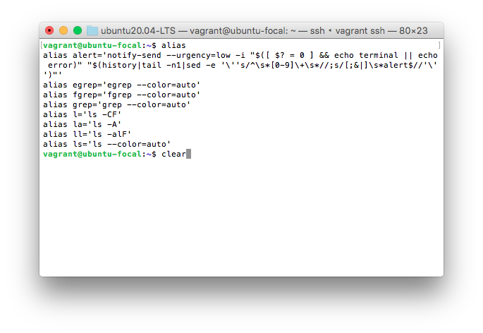
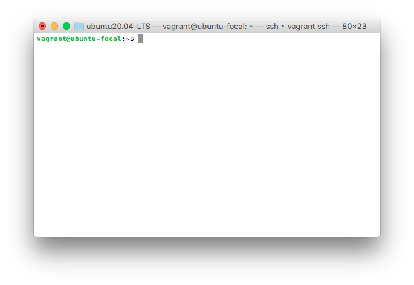

## 7. `sudo` command
This  command means "superuser do", it lets you act as a root user while running a specific command that needs administrator permission. It is how Linux protects itself and prevent users from accidentally modifying the machine's filesystem or installing inappriopriate packages.
it is commonly used to install software or edit files outside the user's home directory. Here we used the command `sudo su` to switch user.

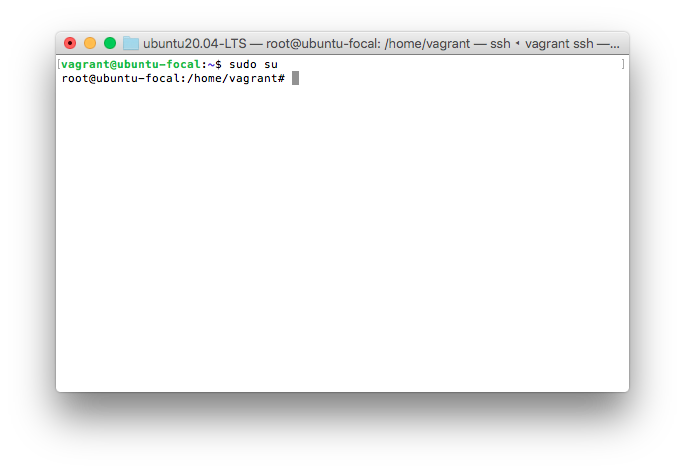

## 8. `exit` command 
The `exit` command does exactly what the name says, with it, you can end a shell session. Here we used it to exit the root user account we switched to above

## 9. `passwd` command
This command allows you to change password for user acoounts
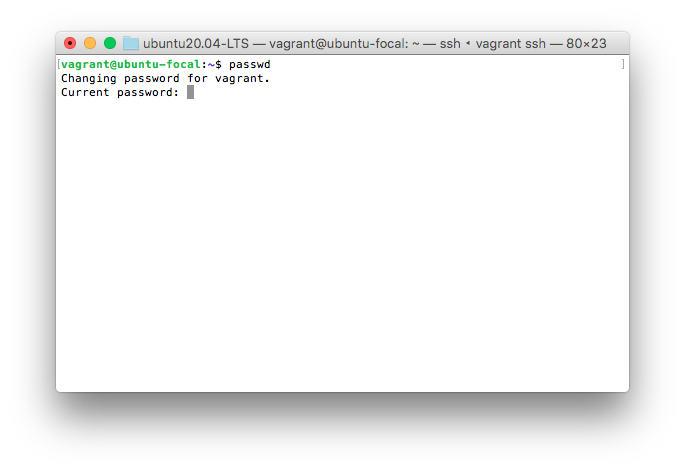

## 10. `htop` command
This command is used to give a detailed and colorful display of the processes running on your machine. It is not installed by default, to exit it, press f10 or q 
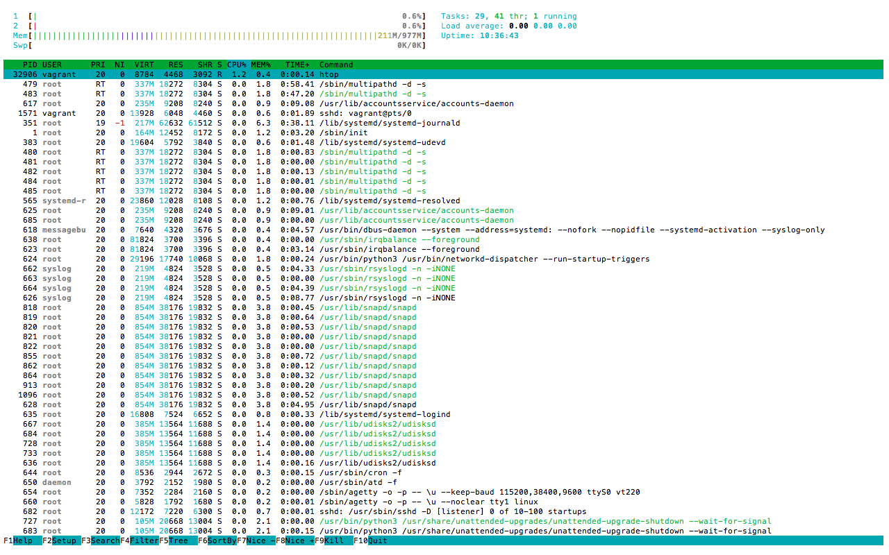
