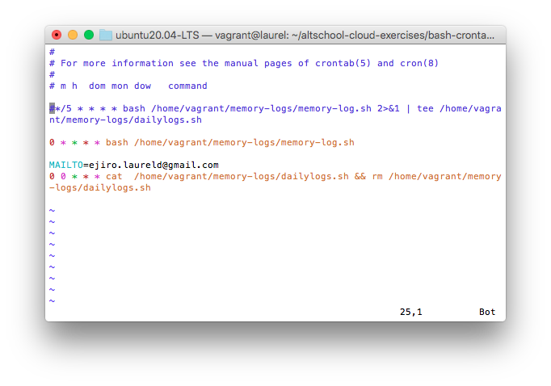

## Task: 
- Create a bash script to run at every hour, saving system memory (RAM) usage to a specified file and at midnight it sends the content of the file to a specified email address, then starts over for the new day.
- Submit the content of your script, cronjob and a sample of the email sent, all in the folder for this exercise.

## Solution
The script is attached to the directory [memory-log.sh](../bash-crontab-exercise/memory-log.sh)

Sample of email

Cronjob 

