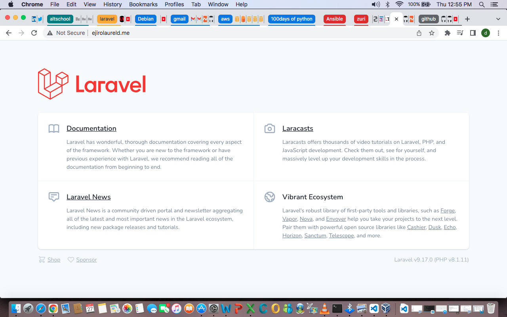

# Deploy a Laravel real world example application  using Debian 11 on a cloud provider.


As a mini project, we were given the task in Altschool to deploy a laravel app (a php framework) using a cloud provider of our choosing. This was a challenging task for me as it was my very first attempt at deployment. a lot of reseacrh and back and forth went into making this work. It was all worth it in the end. 

- Demo project forked from main project repo: https://github.com/EjiroLaurelD/laravel-realworld-example-app
- Setup Debian 11 on a virtual machine instance with a cloud provider(I used AWS)
- Setup apache with every dependency the application needs to run
- Do not use Laravel Sail or Docker as suggested in the project README.md file, simply clone the project with git and deploy with Apache
- Setup MYSQL with credentials and a database for your application to use
- configure a subdomain name if you have a domain name to point to the vm instance
- You have completed the project if you are able to view the application according to the specification in the project from your Host browser.

I have written below the several steps I took in achieving success on this project as best as i can , kindly ask any questions you might have in the comment section .Also i used sudo to run must of the commands as i was working with my root user.


### Setting up a virtual environment
For this, I used an AWS ec2 instance and associated an elastic ip to it to avoid public ip changes. I ssh into the instance using vagrant and carried out the following steps there. 

### Setup apache and every dependency for the app to run
here i installed the following 
- Git
- Apache2
- php8.1 and its dependencies
- mysql and its apt repository
- Composer

first we update our apt and download git
```
sudo apt update
```
```
sudo apt install git -y
```
set up your git config using these commands
```
git config --global user.name "yourgitusername"
```
```
git config --global user.email "youremail@email.com"
```

then we install apache and start apache with the following commands;

```
sudo apt install apache2
``` 

```
sudo systemctl start apache2
```

confirm apache is running with this command

```
sudo systemctl status apache2
```

All things working fine, we move on to Install PHP and its extentions for the Laravel Application.

Note that PHP 8.1 is not included in the Debian 11 default repository. So we need to add the deb.sury.org repository to APT. To do this run these commands 

```
sudo apt-get install ca-certificates apt-transport-https software-properties-common -y
```
once installed , add sury app 

```
echo "deb https://packages.sury.org/php/ $(lsb_release -sc) main" | sudo tee /etc/apt/sources.list.d/sury-php.list
```

Install Gnupg and get the key using these commands

```
sudo apt install gnupg
```

```
sudo wget -qO - https://packages.sury.org/php/apt.gpg | apt-key add -
```

update repository then install PHP 8.1 with these commands

```
sudo apt update
```

```
sudo apt install php libapache2-mod-php php8.1-mysql php8.1-common php8.1-mysql php8.1-xml php8.1-xmlrpc php8.1-curl php8.1-gd php8.1-imagick php8.1-cli php8.1-dev php8.1-imap php8.1-mbstring php8.1-opcache php8.1-soap php8.1-zip php8.1-intl -y
```

confirm the version with 

```
php --v
``` 

### Install Mysql server
The next step is to install mysql database on our virtual machine

```
sudo apt update
```

```
sudo wget https://dev.mysql.com/get/mysql-apt-config_0.8.22-1_all.deb
```

install the release package

```
sudo apt install ./mysql-apt-config_0.8.22-1_all.deb
```

Confirm addition of mySQL 8.0 repository as default when prompted

```
sudo apt update
```

```
sudo apt install mysql-server
```

You will be prompted for a password, choose a password that you can remember easily for now, it can be changed later.

Once the installation is completed, the MySQL service will start automatically. To verify that the MySQL server is running, type:

```
sudo service mysql status
```

Login into your server

```
mysql -u root -p
```

Here, use the password you created earlier

List the available databases

```
SHOW DATABASES;
```
type it exactly as it is with the semicolon

Create your Database

```
CREATE DATABASE name-of-database ;
```
name of database is the name you want to call your database, it can be anything. After doing this, type 

```
exit
```

### Install Composer 

Composer is a dependency manager for PHP used for managing dependencies and libraries required for PHP applications. To install composer run the following command:

```
sudo curl -sS https://getcomposer.org/installer | php
```

then move the composer file to the /usr/local/bin path.

```
sudo mv composer.phar /usr/local/bin/composer
```

change file permission:

```
sudo chmod +x /usr/local/bin/composer
```
check the version installed;

```
composer --version
```

### Clone the git Repo

First, make sure to change directory to apache document root  
```
cd /var/www/
```

Then create a directory to clone the laravel project into, 

```
mkdir miniproject
```

Switch to the directory created in the previous step and clone the project from github

```
cd miniproject
```

```
git clone https://github.com/f1amy/laravel-realworld-example-app.git
 ```
Rename the cloned git repo to a shorter name if you wish, as you wil be referring to the path often

```
mv laravel-realworld-example-app laravelapp
```

```
cd to laravelapp
```

to see al files in this repo, run
```
ls -al
```

Rename the .env.example file to .env using the command:
 ```
mv .env.example .env
```

Edit the .env file
```
sudo vi .env
```
Edit only the following
```
DB_CONNECTION=mysql
DB_HOST=localhost
DB_PORT=3306
DB_DATABASE=enter the name of your database you createdhere
DB_USERNAME=root
DB_PASSWORD=type the mysql password you created here 
```


Save and close the file.
Then change the permission of your project directory `miniproject` and your app `laravelapp`.
```
sudo chown -R www-data:www-data /var/www/miniproject/laravelapp
sudo chmod -R 775 /var/www/miniproject/laravelapp
sudo chmod -R 775 /var/www/miniproject/laravelapp/storage
sudo chmod -R 775 /var/www/miniproject/laravelapp/bootstrap/cache
```

Using composer, install the repository by typing the command below. make sure you are in the project repository to run this command and choose yes for all the prompts.

```
sudo composer install
```
then check the version with the command below
```
php artisan
```

Generate a key for the app

```
sudo php artisan key:generate
```
then run the follwoing commands
```
sudo php artisan migrate
```
```
sudo php artisan config:cache
```
```
sudo php artisan migrate:fresh
```
```
sudo php artisan migrate --seed
```

### Edit the apache2 config file

Create your own config file for the app

```
cd /etc/apache2/sites-available/miniproject.conf
```
edit the code below:
```
ServerName your-domain.com
ServerAdmin webmaster@your-domain.com
DocumentRoot /var/www/html/laravelapp/public


Options +FollowSymlinks
AllowOverride All
Require all granted
ErrorLog ${APACHE_LOG_DIR}/your-domain.com_error.log
CustomLog ${APACHE_LOG_DIR}/your-domain.com_access.log combined
```
Save the file and exit
If you don't have a domain name, use your server Ip address as your domain name.

Enable Apache rewrite module and activate the Laravel virtual host with the following command:

```
sudo a2enmod rewrite
```
```
sudo a2ensite altschool.conf
```

Finally, reload the Apache service to apply the changes

```
sudo systemctl restart apache2
```

Point your domain to your IP address by editing the /etc/hosts file and adding your IP address and your desired domain name.

```
sudo vi  /etc/hosts
```

```
127.0.0.1       localhost
::1     localhost ip6-localhost ip6-loopback
fe00::0 ip6-localnet
ff00::0 ip6-mcastprefix
ff02::1 ip6-allnodes
ff02::2 ip6-allrouters
172.13.0.1      domain-name.com
```

After editing your host machines etc/hosts file, flush your DNS cache afterwards using 

```
sudo systemd-resolve  --flush-caches
```

If you have gotten to this point and encountering a 404 : Not found message, you have succeeded.

<p align="center">
  
</p>

Follow the steps below to see the default Laravel page:

cd into the folder that has the cloned repo, enter the command below;

```
 cd routes
```

Edit the web.php file

```
sudo vi web.php
```

Uncomment the session of the code that starts with "Routes"

```
<?php

use Illuminate\Support\Facades\Route;

/*
|--------------------------------------------------------------------------
| Web Routes
|--------------------------------------------------------------------------
|
| Here is where you can register web routes for your application. These
| routes are loaded by the RouteServiceProvider within a group which
| contains the "web" middleware group. Now create something great!
|
*/

Route::get('/', function () {
    return view('welcome');
}); 
```

remove the backslash/ and the *astericks  
Save and exit

Restart your Apache2 and refresh your browser

Conclusion
This was a very difficult task and you may not get it immediately, follow the steps carefully and watch out for the tiny errors. 


