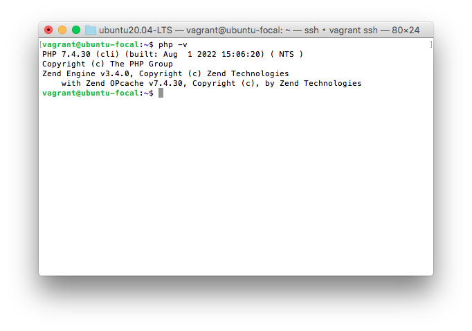

## Instruction: 
- Install PHP 7.4 on your local linux machine using the ppa:ondrej/php package repo.
- Learn how to use the add-apt-repository command
- Submit the content of /etc/apt/sources.list and the output of php -v command.

The content of /etc/apt/sources.list and the output of php -v command.

php-v

