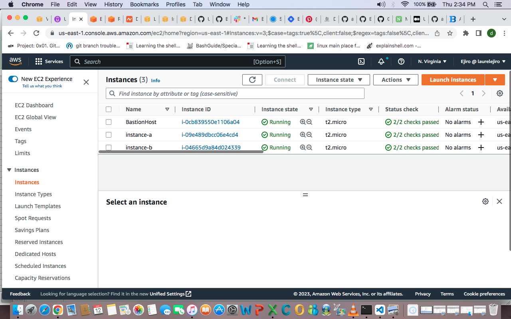

## This project was created to fufil the following instructions, given as a project for Altschool Africa Cloud engineering Semester 3 holiday challenge

### You are required to perform the following tasks

- Set up 2 EC2 instances on AWS(use the free tier instances).
- Deploy an Nginx web server on these instances(you are free to use Ansible)
- Set up an ALB(Application Load balancer) to route requests to your EC2 instances
- Make sure that each server displays its own Hostname or IP address. You can use any programming language of your choice to display this.

### Important points to note:

- I should not be able to access your web servers through their respective IP addresses. Access must be only via the load balancer
- You should define a logical network on the cloud for your servers.
- Your EC2 instances must be launched in a private network.
- Your Instances should not be assigned public IP addresses.
- You may or may not set up auto scaling(I advice you do for knowledge sake)
- You must submit a custom domain name(from a domain provider e.g. Route53) or the ALB’s domain name.

### I solved this task using two methods:
Firstly, I practiced using Ansible to provison the instances on AWS. Also, I used ansible to make configurations on the instances. Playbook is in my repository
[playbook](https://github.com/EjiroLaurelD/altschool-cloud-exercises/tree/master/semester3-exercises/hostname/AWS-Ansible)                                                  
Second method was using the AWS GUI to manually provison servers using auto scaling groups, adding the instances to a target group in a Load balancer. 
I deployed the nginx server and my app using ansible then i used Nat gateway to make the site higly available.
App is live and running with ALB url http://project-alb-362817232.us-east-1.elb.amazonaws.com/
 domain-name: ejirolaureld.me
 
### VPC

### Subnet

### Route table

### Load-Balancer

### Target group

### Autoscaling

### EC2

