## This project was created to satisy the following instructions, given as a project for Altschool Africa Cloud engineering Semester 3 Christmas holiday challenge

### You are required to perform the following tasks

- Set up 2 EC2 instances on AWS(use the free tier instances).
- Deploy an Nginx web server on these instances(you are free to use Ansible)
- Set up an ALB(Application Load balancer) to route requests to your EC2 instances
- Make sure that each server displays its own Hostname or IP address. You can use any programming language of your choice to display this.

### Important points to note:

- I should not be able to access your web servers through their respective IP addresses. Access must be only via the load balancer
- You should define a logical network on the cloud for your servers.
- Your EC2 instances must be launched in a private network.
- Your Instances should not be assigned public IP addresses.
- You may or may not set up auto scaling(I advice you do for knowledge sake)
- You must submit a custom domain name(from a domain provider e.g. Route53) or the ALB’s domain name.

### I solved this task using two methods:
Firstly, I practiced using Ansible to provision the insfracstructure on AWS then also used ansible to deploy Nginx and my app. Playbook is in my repository
[playbook](https://github.com/EjiroLaurelD/altschool-cloud-exercises/tree/master/semester3-exercises/hostname/AWS-Ansible)   while my app repository is [My-App](https://github.com/EjiroLaurelD/hostname-project)                                               

Second method was using the AWS GUI to manually provision the infrastructure , setting up the logical network and EC2 Instances.

I created 3 EC2 instances, one instance(BASTION-HOST) on a public subnet and 2 instances (INSTANCE A and B) on the private subnet using AutoScaling groups. I added the two private instances to a target group in the Load balancer then redirected traffic from the private instance through the bastion host to the ALB. Next, I deployed the nginx server and my app using ansible then I provisoned a Nat-gateway to make the site highly available.

After connecting to the public internet using Nat-gateway, I deleted the Natgateway and released the Elastic IP attached to it.

My-App is live and running with ALB url http://project-alb-362817232.us-east-1.elb.amazonaws.com/
 domain-name: ejirolaureld.me
 
 
## Process guide for the second method

First we have to define a logical network.

Defining a logical network on the cloud simply means to create your  VPC and its components to make your app highly available on the internet. To do this, create the folllowing on your AWS console;
 
### Create VPC
Name your VPC and include a CIDR block 10.0.0.0/16.
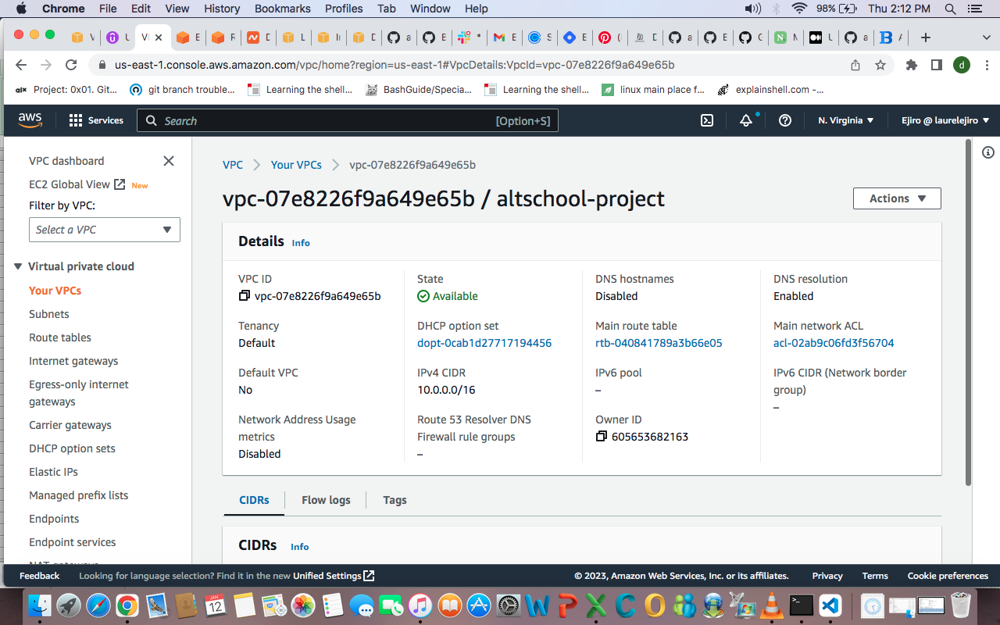

### Subnet
 Create your subnets, two subnets each  for public and private subnets in two availability zones. I used us-east-1a and b zones. 
I used the following CIDR blocks for my subnets  
- private-subnet a  10.0.16.0/20
- private subnet b 10.0.32.0/20
- public subnet a 10.0.0.0/24
- public subnet b 10.0.1.0/24

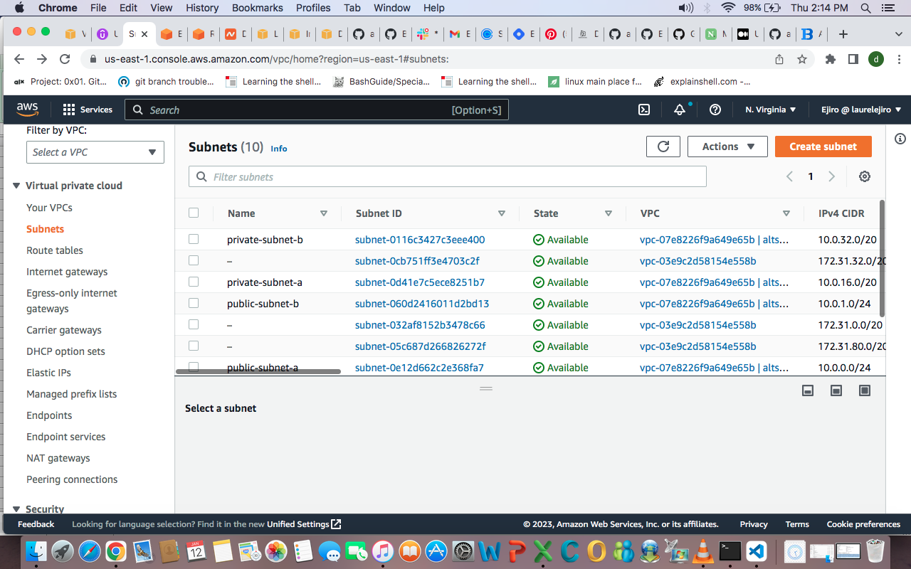

### Internet Gateway
Create an Internet gateway to allow internet access through our instances and attach it to your VPC. To do this;
- Click on internet gateway, go to actions then click on attach to VPC. 
- Make sure to attach it to the VPC created for your project using the actions dropdown.

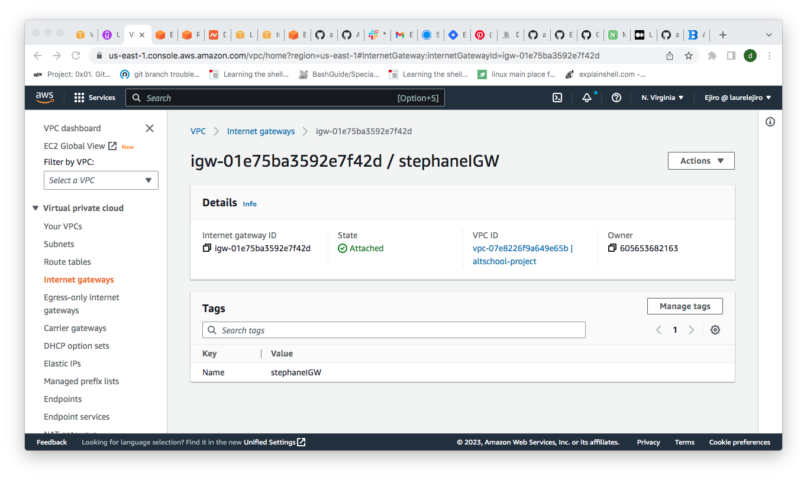

### Route table
- Create route tables and make sure to attach it to the right VPC, the one created.
- Click on edit route tables under actions. Add route with the CIDR 0.0.0.0/0  as your destination, then use your created Internet gateway as your target and save changes. 
- Under actions click on edit subnet associations and add your public subnet to your public route table. 

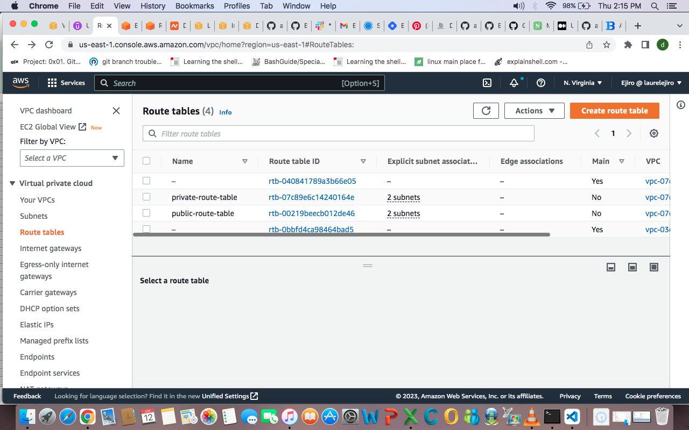

### NAT gateway
- Create a NAT-gateway and allocate  an elastic IP to it. Go back to your route tables and edit route tables under actions. Add route with the CIDR 0.0.0.0/0  as your destination, and set target as Nat-gateway then  save changes.
- Under actions click on edit subnet associations and add your public subnet to your public route table.

Viola! Our network is set up.
Lets move on to creating our Instances.

## CREATING OUR INSTANCES
After we create our network, the next thing is to provision our EC2 instances. To do this we will be creating 1 public instance which will serve as our Bastion host and 2 private instances where we will be deploying our apps to.

### Creating the Bastion Host
To do this;
- Create a Public Instance in the public subnet of your VPC and name it Bastion-Host. We are creating it in the public subnet because it is going to be our traffic port

- Assign a keypair because you will need it to ssh into the private instances we will create shortly with Autoscaling groups

- Create a security group and give it the following rules;
     - Inbound rule: allow ssh  anywhere CIDR 0.0.0.0/0
     - Outbound rule: allow All traffic CIDR 0.0.0.0/0

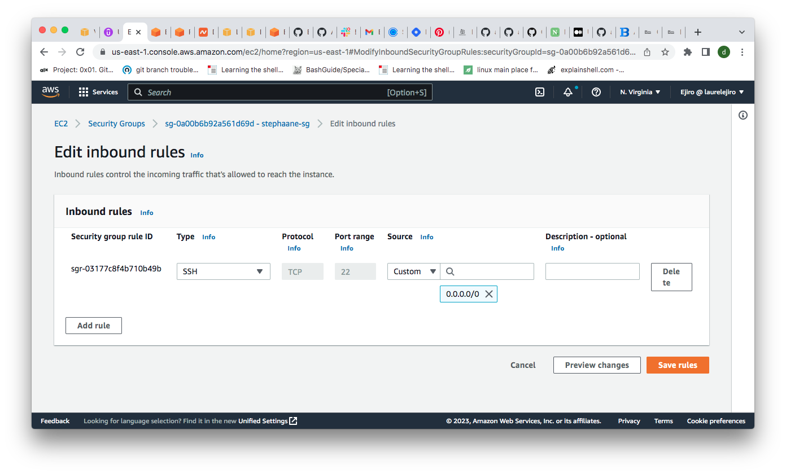
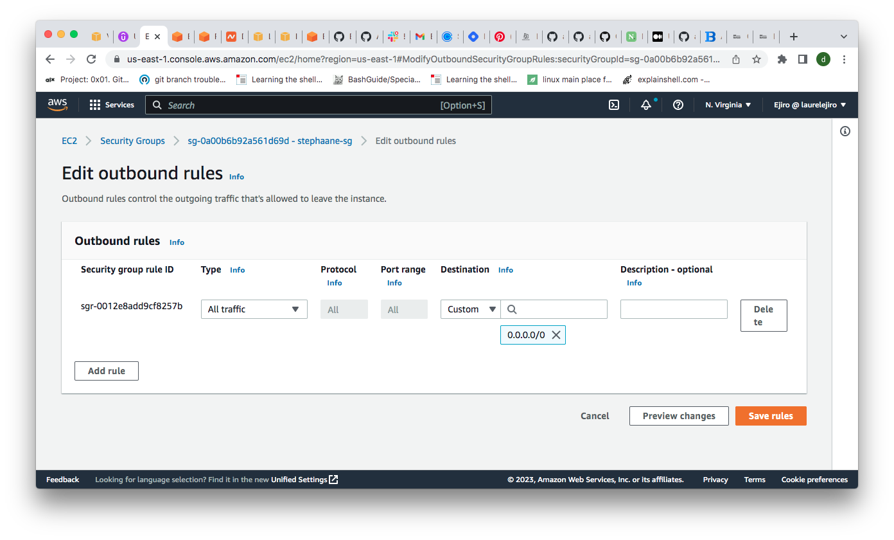

Next we create our private instances using AutoScaling groups

### AutoScaling Groups

- Navigate to Autoscaling groups at the bottom of your EC2 dashboard and click on create.

- Choose a name for your ASG and create a launch template.

- Choose the name of your ASG

- Choose your linux distribution and select t2micro

- Select a Key Pair. Make sure to use same key with your Bastion host or copy the newly created keypair to your Bastion host. We need this to be able to SSH from the bastion host to the private instances we'll be provioning with ASG.

- Do not include subnet in launch template. we will include the subnet in the autoscaling group itself.

- Create security groups with the rules as seen below in image. (Please make sure to edit the rules to include the security group of the ALB after we create it. I took screenshots after I had completed my process  that is why we can see the rule with the ALB sec group at this point)

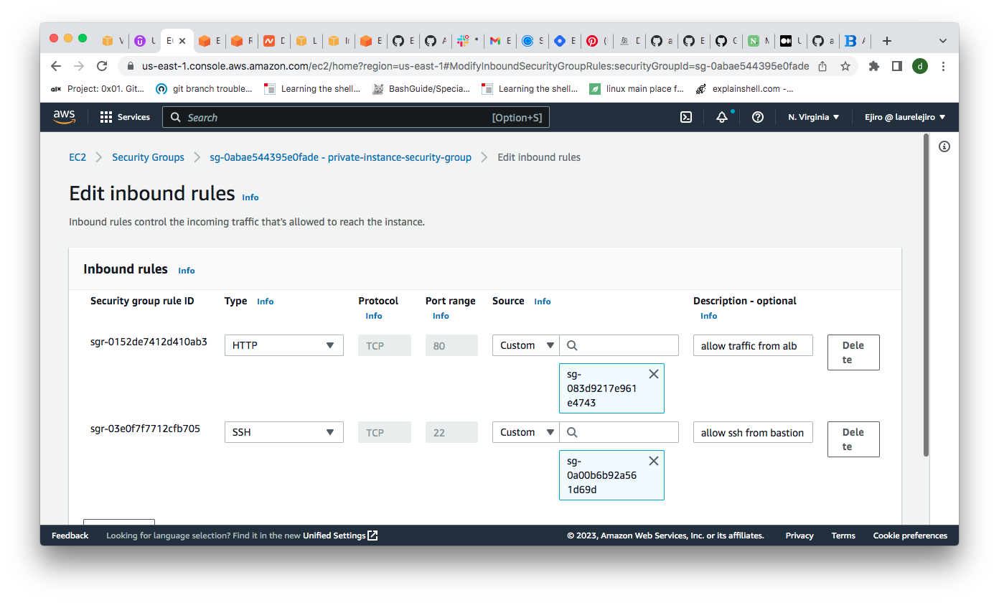

- Create launch template and move on to continue creating the ASG with the launch template we just created

- Select your VPC and select private subnet

- Skip all other settings until you get to Group size and scaling policy then select your desired, max and min capacity. I used 2 because i want 2 instances at all times

- Click create autoscaling group and you should have the settings as seen in the image below

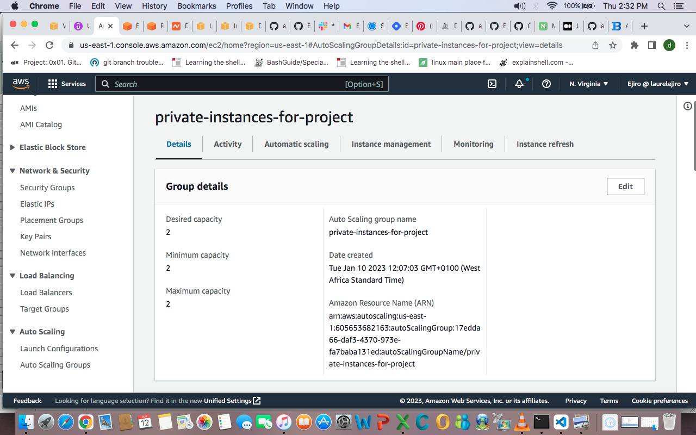

### Application Load-Balancer
- Create an Application load balancer, give it a name and make sure it's internet facing.

- Select your VPC and select the network mappings across your subnets

- Create a security group with the following rules:

- Inbound rule: Allow HTTP on port 80 from anywhere CIDR 0.0.0.0/0

- Oubound rule: Allow HTTP on port 80 to destination private instance security

- Under Listeners and Routing, create a target group comprising of the instances that your autoscaling group scaled up for you. Make sure to include all the instances you want to deply your app to. That is, the two private instances. 
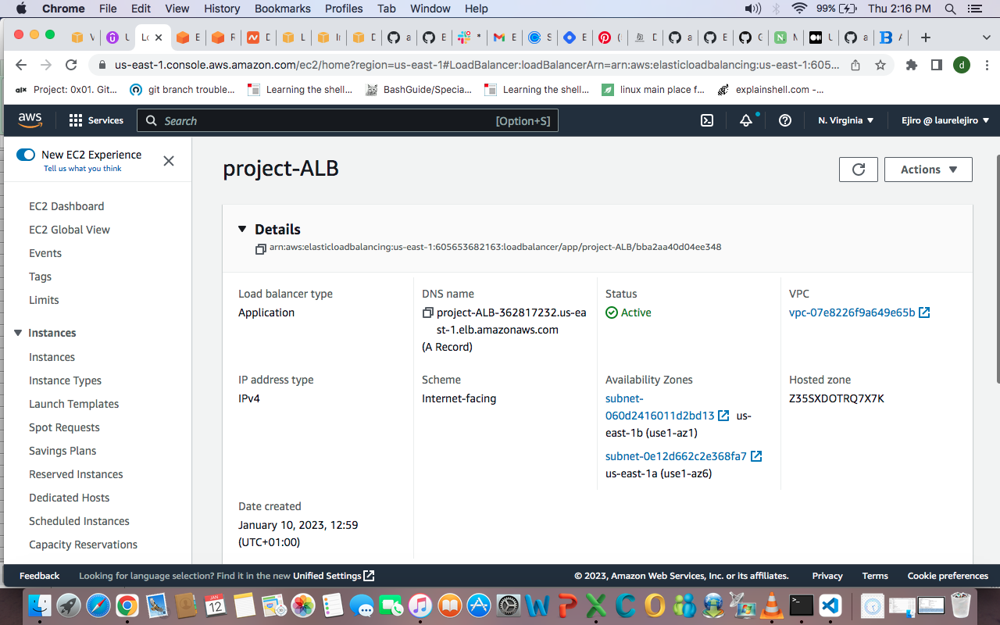

### DEPLOY APP WITH ANSIBLE PLAY-BOOK

Connect to your bastion host using ssh or aws connect and make sure to copy the .pem key you created for your instances to your bastion host if it isn't there already. SSH into your instances from your bastion host to confirm your connection is working perfectly then deploy your playbook to the app.
Kindly check in this [playbook](https://github.com/EjiroLaurelD/altschool-cloud-exercises/tree/master/semester3-exercises/hostname) repostiory for my playbook to use as a guide to build your if you do not know how to build one.
Also note there is a UI template attached to our set up. you can edit it out if you do not want it.

### Target group
Confirm that your target groups are showing healthy after successful deployment. 

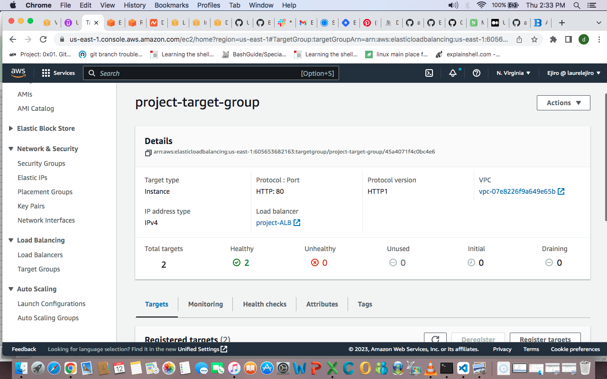

Viola, your app is highly available. Use the ALB link to view it and it should look like this with our two host ips displaying on each refresh.
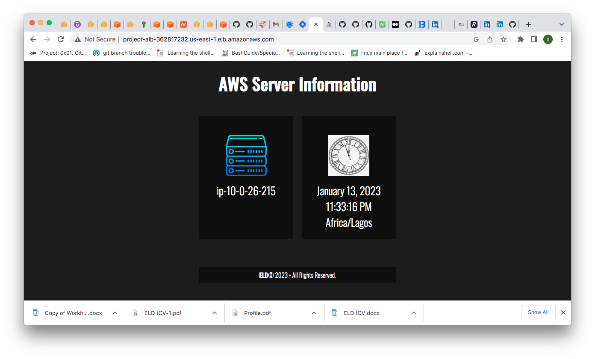

Delete your Nat gateway as it is not a free service and release the Elastic Ip.

Your App will be on and running as long as you do not do any further update on it. So unless you are completely done with the setup, do not delete your Nat gatway.

We have come to the end of this project, I hope you enjoyed it as I much as I did.

Thank you for reading my process.

I will be documenting the process of Configuring the entire process (Infrastructure as code) with an updated Ansible-playbook shortly.

Watch this space!

