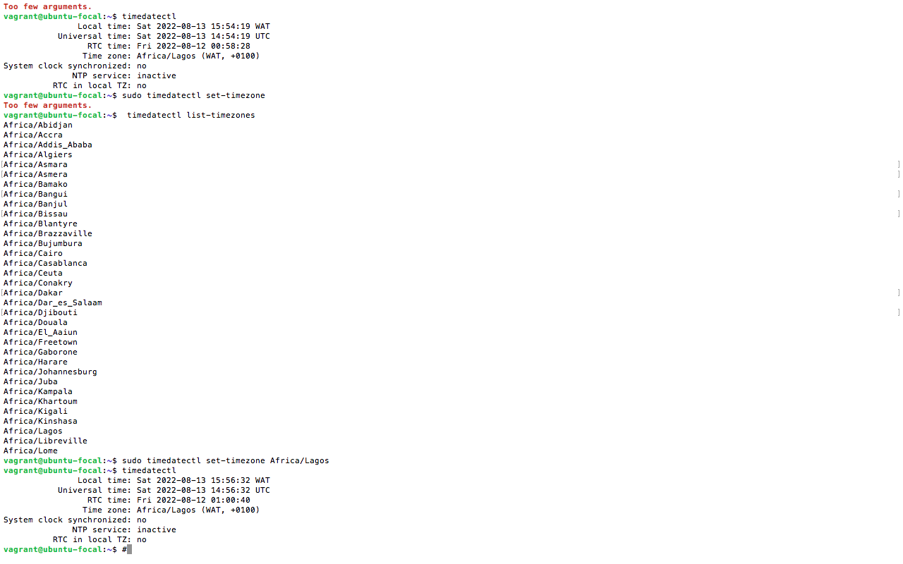

## Exercise 1 - learn how to set timezones on your terminal and set the time zone on your machine. 
e

## Linux Timezones Commands 

## `timedatectl`

This command displays current Timezone

## `timedatectl list-zones`

This command displays a list of timezones 

## `sudo timedatectl set-timezone <your_time_zone>`

 This will set timezone to your preferred timezone on the list, for example let us set for Africa/Lagos.  You have to run the command as root user or sudo user
`sudo timedatectl set-timezone Africa/Lagos`

